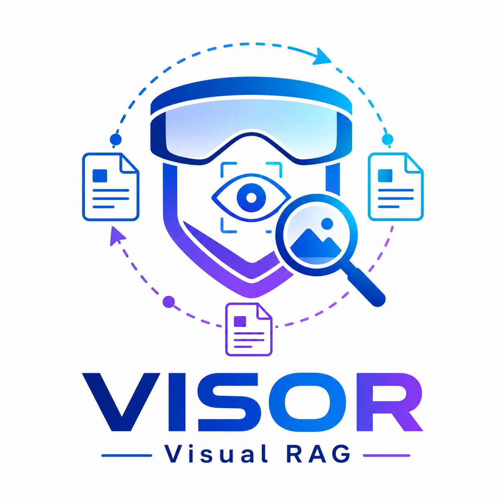
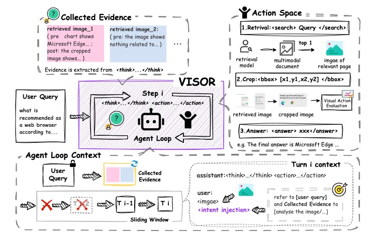

# VISOR: Agentic Visual Retrieval-Augmented Generation via Iterative Search and Over-horizon Reasoning

<p align="center">
  
</p>

>🎉 **News:** VISOR has been accepted to ACM Multimedia (ACM MM) 2026.

## 🚀 Overview

<p align="center">
  
</p>

VISOR is an agentic visual retrieval-augmented generation framework for complex question answering over visually rich documents. See our [paper](https://arxiv.org/abs/2604.09508) for details.


## Installation

Our environment is fully aligned with [VRAG-RL](https://github.com/Alibaba-NLP/VRAG/tree/main/VRAG-RL), but actual deployment may require environment-specific debugging, adaptation, and additional packages.

### Inference Environment

```bash
# Create environment
conda create -n VISOR python=3.10 -y
conda activate VISOR

# Install requirements for inference
pip install -r requirements_demo.txt
```

The demo uses an OpenAI-compatible endpoint for VLM inference. A locally deployed vLLM server can be used without a real API credential.

### Training Environment

```bash
# Create environment
conda create -n VISOR python=3.10 -y
conda activate VISOR

# Install requirements for training
pip install -r requirements_train.txt

# Install the VISOR package
pip install -e .
```

Exact PyTorch, CUDA, FlashAttention, and vLLM compatibility depends on the target GPU environment. Verify these versions before installing optional compiled packages.

## Build Your Own VISOR

Below is a step-by-step guide to running the VISOR agent on your own corpus. The entire process is divided into three steps:

- The first and second steps build a purely vision-based search engine for your corpus.
- The third step launches the VISOR agent for inference.

First, convert your documents into `.jpg` images using `search_engine/corpus/pdf2images.py` and store them under `<DATASET_ROOT>/img/`.

### Step1. Build the Index Database
Our framework is built on the foundation of the Llama-Index. We preprocess the corpus in advance and then establish an index database.

The embedding models are located in `search_engine/models/`. You can test and use the search engine directly.

### Step2. Run Multi-Modal Retriever
Try using the search engine in `search_engine/search_engine.py` (from project root):
```python
from search_engine.search_engine import SearchEngine

# Initialize engine
search_engine = SearchEngine(
    dataset_dir='search_engine/corpus',
    node_dir_prefix='colqwen_ingestion',
    embed_model_name='vidore/colqwen2-v1.0'
)
# Retrieve some results
recall_results = search_engine.batch_search(['some query A', 'some query B'])
```
Once the corpus and models for the search engine are prepared, you can directly run the search engine API server:
```bash
# Run search engine server with FastAPI (from project root VRAG/)
python search_engine/search_engine_api.py
```
### Step3. Run VISOR

First, start the OpenAI-compatible VLM service:

```bash
vllm serve Qwen/Qwen2.5-VL-7B-Instruct \
  --port 8001 \
  --host 0.0.0.0 \
  --limit-mm-per-prompt image=10 \
  --served-model-name Qwen/Qwen2.5-VL-7B-Instruct
```

Then, from the project root, launch the VISOR agent:

```bash
python demo/visor_agent.py
```

The final question is configured in the `main(...)` call at the end of `demo/visor_agent.py`. This script is intended as a debugging framework for the VISOR agent: it prints intermediate reasoning, search queries, and bounding-box actions during inference. Retrieved image paths and cropped image paths are printed, while cropped images are saved to `./crop_images/` by default.

The model endpoint, search endpoint, maximum number of steps, prompts, crop output directory, and event handling can be adjusted in `demo/visor_agent.py` as needed.

## ⚙️ Train Model with VISOR

### Step1. Prepare Data.

#### Benchmark & Training Data
Please download the original document repositories and queries for each benchmark separately from [SlideVQA](https://huggingface.co/datasets/NTT-hil-insight/SlideVQA), [ViDoSeek](https://huggingface.co/datasets/autumncc/ViDoSeek) and [MMLongBench-Doc](https://huggingface.co/datasets/yubo2333/MMLongBench-Doc). For training, we mixed part of the [SlideVQA](https://huggingface.co/datasets/NTT-hil-insight/SlideVQA) training set to create the training data. The SlideVQA-train can be used as an example to construct SFT data and RL data. During evaluation, we suggest merge all benchmark corpora into a single corpus to create a more challenging setting that simulates real-world scenarios.

#### Example Data & Dataset Conversion
Organize all data into the following format. Reference examples are provided in the `examples/` directory.
```json
{
    "uid": "04d8bb0db929110f204723c56e5386c1d8d21587_2",
    "query": "What is the temperature of Steam explosion of Pretreatment for Switchgrass and Sugarcane bagasse preparation?", 
    "reference_answer": "195-205 Centigrade", 
    "meta_info": {
        "file_name": "Pretreatment_of_Switchgrass.pdf", 
        "reference_page": [10, 11], 
        "source_type": "Text", 
        "query_type": "Multi-Hop" 
    }
}
```

Use the script `scripts/hf_dataset_convert.py` to convert the unified format to Parquet.
```bash
# Run from VRAG-RL/ directory
python scripts/hf_dataset_convert.py
```

### Step2. Build Training Corpus & Run Multi-Modal Search Engine.

Follow the above section to construct your own corpus and start the search engine.

### Step3. Construct High-quality CoT & Learn Patterns via SFT.

We provide reference code for constructing retrieval-augmented CoT trajectories, converting them into SFT data, and launching SFT training. These files represent separate stages of the workflow rather than a ready-to-run three-command pipeline:

1. Use `scripts/data_construct_pipeline.py` as the basic implementation for generating multi-turn search, reasoning, bounding-box, and answer trajectories. Configure its dataset, image, retrieval-service, model, and output settings before use.
2. After validating and filtering the generated trajectories, adapt `scripts/cot_convert_sft.py` to convert them into the multi-modal conversation format required by SFT. The conversion stage must reference the correct source images and any cropped images constructed from bounding-box actions.
3. Once the final SFT dataset has been prepared and all model and data paths have been updated, use `scripts/sft.sh` as the training entry point.

During development, we explored several data-construction strategies, including an additional verification search, repeated intent injection, and replacing generated answers with standardized ground-truth answers. To preserve these research iterations, the corresponding experimental scripts remain under `scripts/`, while representative intermediate datasets are provided under `data/`:

- `SlideVQA-SFT-new.json`: the basic SFT data aligned with the [VRAG-RL](https://github.com/Alibaba-NLP/VRAG/tree/main/VRAG-RL) interaction format.
- `SlideVQA-SFT-verification.json`: the basic data augmented with an additional verification-search round.
- `SlideVQA-SFT-verification_intent.json`: the verification data with the original question and action guidance injected into subsequent observations.
- `SlideVQA-SFT-verification_intent_stdans.json`: the intent-injected data with the final responses replaced by standardized answers.

These scripts record successive research iterations and may contain experiment-specific configurations rather than a single unified entry point. Before running them, update dataset locations, image directories, model/API endpoints, output paths, and the training-script path for your environment. Bounding-box actions also require constructing and saving the corresponding cropped images from the source image, then inserting the resulting image paths into the converted multi-modal conversations; make sure the coordinate convention and image resizing are consistent with your VLM.

The verification and intent-enhanced variants can be used as references for further data refinement, but they are not required. The basic VRAG-RL-aligned CoT construction is already a valid SFT starting point and can still benefit from the subsequent VISOR-specific reinforcement-learning stage.

### Step4. Run RL Training with Qwen2.5-VL-Instruct.

#### Reward Function
You can customize your own training reward function in `verl/workers/reward_manager/rm.py`. In this project, we simply modify the reward manager to implement a model-based reward. You can choose to deploy your own model with [vLLM](https://docs.vllm.ai/en/stable/configuration/serve_args.html) or use an [API](https://bailian.console.aliyun.com/#/home). 
```bash
# works num for reward model, depends on your qps
reward_model.rm_workers_num=10 \
# reward model url, if you deploy your own model, you can use your own model here
reward_model.rm_url="https://dashscope.aliyuncs.com/compatible-mode/v1/chat/completions" \
# reward model key, if you deploy model with vLLM, you can use "EMPTY"
reward_model.rm_key=$DASHSCOPE_API_KEY \
# reward model name
reward_model.rm_model_name="qwen-max-latest" \
```

#### Rollout Module

The rollout module is the core of VISOR. `vrag_agent/generation.py` implements the VISOR rollout manager, including evidence collection, sliding-context reconstruction, intent injection, visual search and bounding-box interaction, and evidence-grounded final-answer generation. Its main function, `run_llm_loop`, follows the iterative process Generation -> Parse Action -> Observation -> Check Termination:

- **Generation**: `_generate_with_gpu_padding` pads the active training batch to satisfy multi-GPU execution requirements and performs sequence generation.
- **Parse Action**: `execute_predictions` parses `<search>`, `<bbox>`, and `<answer>` actions from the model output, invokes the corresponding search or image interaction, and returns the raw observation.
- **Observation and Context Update**: `_process_next_obs` processes retrieved or cropped images and inserts them into the rolling multimodal context. VISOR additionally records reasoning in the evidence ledger, injects the original question and action guidance, and reconstructs the context with a sliding window.
- **Termination**: `run_llm_loop` tracks active trajectories and checks whether each interaction has finished. At the final step, unfinished trajectories are prompted to answer from the collected evidence. Trajectories without retrieved images receive a placeholder image and matching image padding so that the vLLM engine can complete batched multimodal generation consistently.

For comparison, `vrag_agent/generation_vrag.py` preserves the original [VRAG-RL](https://github.com/Alibaba-NLP/VRAG/tree/main/VRAG-RL) rollout implementation. You can use it as a baseline and modify either generation module to develop or ablate different interaction strategies. The active generation manager is imported, configured, initialized, and invoked in `verl/trainer/ppo/ray_trainer.py`; this is also the main entry point for switching implementations and debugging the rollout process. When making changes, keep the generation interface consistent with the search service, multimodal observations, and trainer configuration.

#### Start Training
```bash
# Run from VRAG-RL/ directory
./train_grpo_qwen2_5_vl_7b.sh
```

#### Start Evaluating
```bash
# Run from VRAG-RL/ directory
./qwen2.5_test.sh
```
After evaluation, each run is recorded under the `case/` directory in the project root: `case/<dataset>_<timestamp>.json` stores the full trajectories (query, reference answer, model answer, score, reasoning trace, evidence ledger, and retrieved images), and `case/<dataset>_<timestamp>/` stores the cropped images produced by `<bbox>` actions. You can analyze these records to further optimize your work.

## 📌 Notice

This repository is our first public release of VISOR. Although we have made every effort to provide the core implementation and research artifacts, some paths, environment-specific configurations, and experimental details may still require adaptation and debugging before the full pipeline can run in a new environment. We sincerely apologize for any inconvenience this may cause. Questions, discussions, and suggestions are warmly welcomed, and we will continue improving the repository based on community feedback.

## 🙏 Acknowledge

This work is implemented based on [ViDoRAG](https://github.com/Alibaba-NLP/ViDoRAG), [VRAG-RL](https://github.com/Alibaba-NLP/VRAG/blob/main/VRAG-RL/), [Search-R1](https://github.com/PeterGriffinJin/Search-R1), and [verl](https://github.com/volcengine/verl). We greatly appreciate their valuable contributions to the community.

## 📝 Citation

```bibtex
@article{shen2026visor,
  title={VISOR: Agentic Visual Retrieval-Augmented Generation via Iterative Search and Over-horizon Reasoning},
  author={Shen, Yucheng and Wu, Jiulong and Huang, Jizhou and Yin, Dawei and Yan, Lingyong and Cao, Min},
  journal={arXiv preprint arXiv:2604.09508},
  year={2026}
}
```
